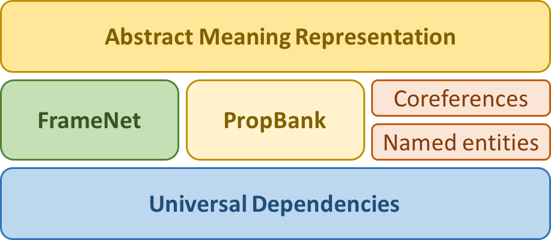

# FullStack-LV: Full Stack of Latvian Language Resources for NLU and NLG

## Introduction

This repository contains a multilayer text corpus of Latvian. The broad application area we address is natural language understanding (NLU) and generation (NLG), and the aim of the corpus is to develop a data-driven NLU and NLG [toolchain for Latvian](http://nlp.ailab.lv/), as well as to use it in linguistic studies. Both the multilayer corpus and the downstream applications are anchored in cross-lingual state-of-the-art representations: [Universal Dependencies](http://universaldependencies.org/) (UD), [FrameNet](https://framenet.icsi.berkeley.edu/fndrupal/), [PropBank](https://propbank.github.io/) and [Abstract Meaning Representation](https://amr.isi.edu/) (AMR). A complementary representation, language resource and technology for NLG, which is being developed separately (incl. the Latvian resource grammar), is [Grammatical Framework](http://www.grammaticalframework.org/) (GF).

The UD representation is automatically derived from a more elaborated and manually annotated [hybrid dependency-constituency representation](http://sintakse.korpuss.lv/).
The FrameNet annotations are manually added, guided by the underlying UD annotations. Consequently, frame elements are represented by the root nodes of the respective subtrees instead of text spans; the spans can be easily calculated from the subtrees.
The PropBank layer is automatically derived from the FrameNet and UD annotations, provided a manual mapping from FrameNet lexical units to PropBank frames, and a mapping from FrameNet frame elements to PropBank semantic roles for the given pair of FrameNet and PropBank frames.
Draft AMR graphs are derived from the PropBank and UD layers, as well as auxiliary layers containing named entity and coreference annotations. The semantically rich FrameNet annotations are also helpful in acquiring more accurate AMR graphs.

We aim at a medium-sized corpus: 10-15 thousand sentences annotated at all layers. Therefore it is important to ensure that the multilayer corpus is balanced not only in terms of text genres and writing styles but also in terms of lexical units.
A fundamental design decision is that the text unit is an isolated paragraph. The multilayer corpus therefore consists of manually selected paragraphs from many different texts of various types. Representative paragraphs are selected in different proportions from a balanced 10-million-word text corpus: 60% news sources, 20% fiction, 10% legal texts, 5% spoken language, 5% miscellaneous.

As for lexical units, the goal is to cover 1,000-2,000 most frequently occurring verbs, calculated from the 10-million-word corpus. Since the most frequent verbs tend to be the most polysemous, we expect that the number of lexical units (verb senses w.r.t. semantic frames) will be considerably larger (2,000-4,000). We expect that the corpus is rather balanced also w.r.t. nominal lexical units.

## Annotation layers

## Publications

N. Gruzitis, L. Pretkalnina, B. Saulite, L. Rituma, G. Nespore-Berzkalne, A. Znotins, P. Paikens. [Creation of a balanced state-of-the-art multilayer corpus for NLU](http://www.lrec-conf.org/proceedings/lrec2018/pdf/935.pdf). Proceedings of the 11th International Conference on Language Resources and Evaluation (LREC), 2018

A. Znotins, E. Cirule. [NLP-PIPE: Latvian NLP Tool Pipeline](http://ebooks.iospress.nl/volumearticle/50320). Human Language Technologies - The Baltic Perspective. Frontiers in Artificial Intelligence and Applications, vol. 307, IOS Press, 2018

N. Gruzitis, G. Nespore-Berzkalne, B. Saulite. [Creation of Latvian FrameNet based on Universal Dependencies](http://lrec-conf.org/workshops/lrec2018/W5/pdf/9_W5.pdf). Proceedings of the International FrameNet Workshop 2018: Multilingual FrameNets and Constructicons (IFNW), 2018

G. Nespore-Berzkalne, B. Saulite, N. Gruzitis. [Latvian FrameNet: Cross-Lingual Issues](http://ebooks.iospress.nl/volumearticle/50309). Human Language Technologies - The Baltic Perspective. Frontiers in Artificial Intelligence and Applications, vol. 307, IOS Press, 2018

Paikens, P., Grūzītis, N., Rituma, L., Nešpore, G., Lipskis, V., Pretkalniņa, L., Spektors, A. [Enriching an Explanatory Dictionary with FrameNet and PropBank Corpus Examples](https://elex.link/elex2019/wp-content/uploads/2019/09/eLex_2019_52.pdf). Proceedings of the 6th Biennial Conference on Electronic Lexicography (eLex), 2019

L. Pretkalnina, L. Rituma, B. Saulite. [Deriving Enhanced Universal Dependencies from a Hybrid Dependency-Constituency Treebank](https://link.springer.com/chapter/10.1007/978-3-030-00794-2_10). Text, Speech, and Dialogue. Lecture Notes in Computer Science, vol. 11107, Springer, 2018

N. Gruzitis, D. Gosko, G. Barzdins. [RIGOTRIO at SemEval-2017 Task 9: Combining machine learning and grammar engineering for AMR parsing and generation](http://www.aclweb.org/anthology/S17-2159). Proceedings of the 11th International Workshop on Semantic Evaluation (SemEval), 2017

## Related work

- [NLP-PIPE: Latvian NLP Tool Pipeline](https://github.com/LUMII-AILab/nlp-pipe)
- [Tēzaurs - The largest open lexical database for Latvian](https://github.com/LUMII-AILab/Tezaurs)

## Acknowledgements

This work is supported by the European Regional Development Fund under the grant agreements No. 1.1.1.1/16/A/219 (*Full Stack of Language Resources for Natural Language Understanding and Generation in Latvian*) and No. 1.1.1.2/VIAA/1/16/188 (*From Abstract Meaning Representation to Natural Language Sentence and Coherent Text Generation*).

The treebank layer from which the UD reresentation is derived has been annotated using an extended version of [TrEd](https://ufal.mff.cuni.cz/tred/). The FrameNet layer as well as the named entity and coreference layers have been annotated using a customised instance of [WebAnno](https://webanno.github.io/webanno/). Draft AMR graphs have been acquired using the [Hugo.lv](https://hugo.lv/en) LV-EN neural MT system and the [AMREager](http://cohort.inf.ed.ac.uk/amreager.html) parser.

## Licence

These data sets by [AiLab](http://ailab.lv) are licensed under a [Creative Commons Attribution-ShareAlike 4.0 International License](https://creativecommons.org/licenses/by-sa/4.0/).

By using these data sets, you agree to comply with the European Intellectual Property Rights and the European General Data Protection Regulation.

Please, cite the relevant [publications](https://github.com/LUMII-AILab/FullStack#publications) if you use this data in your research. Please, [let us know](mailto:fullstack@ailab.lv) if you use this data in the development of products or services. Your citations and feedback are important to secure funding for the further development of these data sets.

## Contacts

Project coordinator: [Normunds Grūzītis](https://www.linkedin.com/in/normundsg), `normunds.gruzitis@ailab.lv`

Team members: Ilze Auziņa, Guntis Bārzdiņš, Roberts Darģis, Mikus Grasmanis, Kristīne Levāne-Petrova, Gunta Nešpore-Bērzkalne, Pēteris Paikens, Lauma Pretkalniņa, Laura Rituma, Inguna Skadiņa, Baiba Valkovska (Saulīte), Artūrs Znotiņš
